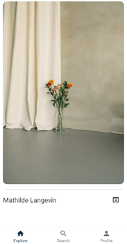
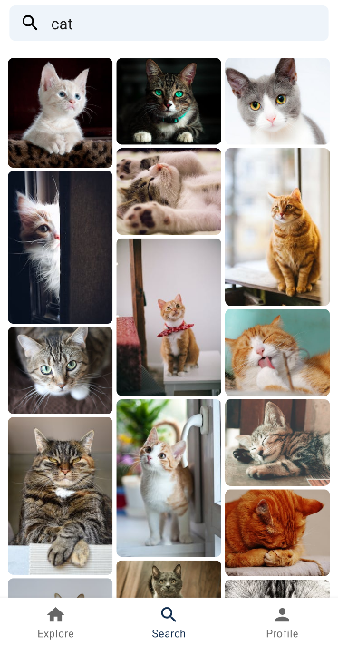

# Pexels

An image finder app powered by pexels API using the **MVVM architecture** and the following libraries:

- Retrofit
- Hilt dependency injection
- Glide
- [ScrollingPagerIndicator](https://github.com/Tinkoff/ScrollingPagerIndicator) for viewpager indicator
- also kotlin coroutines and kotlin flows

  

  

  

